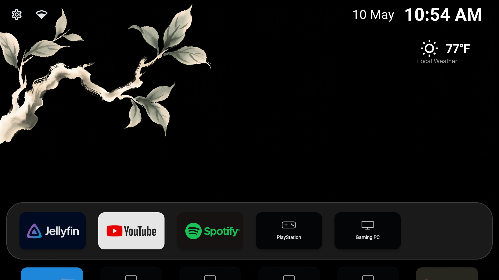
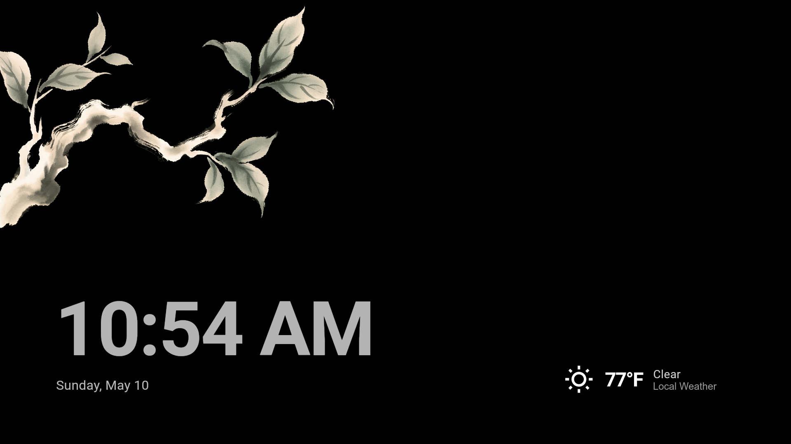
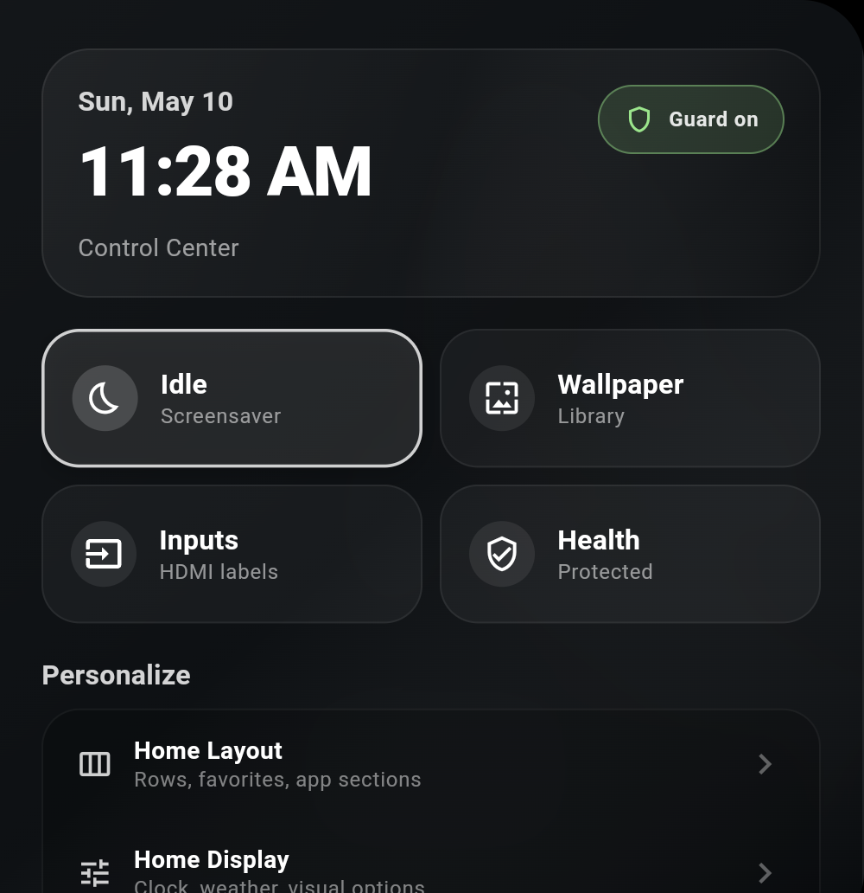

<p align="center">
  
</p>

# OpenCore TV

OpenCore TV is a custom Android TV and Fire TV launcher built around a clean home screen, high-resolution wallpapers, device-aware shortcuts, weather, and an integrated idle/screensaver mode.

The app now uses device profiles so Fire TV, Google TV, and generic Android TV devices can share one codebase while keeping Fire OS-specific rescue behavior isolated to supported devices.

## Screenshots

| Home | Idle / Screensaver | Control Center |
| --- | --- | --- |
|  |  |  |

## What It Does

- Replaces the stock TV home flow with a custom launcher experience.
- Shows apps and supported HDMI/source shortcuts together so inputs can live in Favorites.
- Lets input tiles use custom labels and icons.
- Opens an OpenCore-owned input selector from the physical Input/Source button when you are outside the launcher home screen.
- Uses bundled high-resolution wallpapers instead of relying on broken Android TV wallpaper pickers.
- Organizes wallpapers through a catalog with brightness and category tags for dark/light appearance modes.
- Adds weather, clock, and location-aware home/idle widgets.
- Turns the launcher into its own idle/screensaver surface instead of depending on system screensaver routing.
- Includes Launcher Protection settings to verify the home button/default launcher setup.
- Keeps Fire TV Home Guard support for Fire OS devices where the stock launcher cannot be fully disabled without system privileges.
- Ships separate install paths for generic Android TV and Fire TV development devices.

## Build

Stable APKs are published on the [GitHub Releases page](https://github.com/eponce00/OpenCore-TV/releases). Use the local build flow when developing or testing changes directly on the TV.

To publish a new GitHub Release:

```powershell
.\scripts\publish-release.ps1
```

```powershell
. .\scripts\arc-env.ps1
flutter pub get --offline
flutter build apk --release
```

The release APK is generated at:

```text
build\app\outputs\flutter-apk\app-release.apk
```

## Install / Update

```powershell
.\scripts\dev-install.ps1
```

`dev-install.ps1` remains the Fire TV development install path. It builds the release APK, installs it, restores Home Guard, grants the development permissions used by the Fire OS Home rescue flow, and launches OpenCore.

For Google TV or generic Android TV devices:

```powershell
.\scripts\install-android-tv.ps1 -Device 192.168.1.12
```

Add `-SetHome` to ask Android to prefer OpenCore as the HOME activity without disabling the stock launcher.

For all TVs in the local home inventory:

```powershell
.\scripts\install-tv-fleet.ps1
```

The real inventory lives in gitignored `config\tv-fleet.local.yaml`; use `config\tv-fleet.example.yaml` as the safe checked-in template.

If Fire OS ever disables Home Guard after an update or reinstall:

```powershell
.\scripts\enable-home-guard.ps1
```

Details and manual recovery commands live in [docs/HOME_GUARD_SETUP.md](docs/HOME_GUARD_SETUP.md).

## Development Notes

- Package id: `tv.opencore.launcher`
- Flutter package: `opencore_tv`
- Current maintained test gate: `. .\scripts\arc-env.ps1; flutter test --no-pub`
- Agent/project guide: [AGENTS.md](AGENTS.md)
- Feature tracker: [docs/FEATURE_TRACKER.md](docs/FEATURE_TRACKER.md)
- Fire TV setup: [docs/FIRE_TV_SETUP.md](docs/FIRE_TV_SETUP.md)
- Android TV setup: [docs/ANDROID_TV_SETUP.md](docs/ANDROID_TV_SETUP.md)
- Device profiles: [docs/DEVICE_PROFILES.md](docs/DEVICE_PROFILES.md)
- Google TV HOME notes: [docs/GOOGLE_TV_HOME_OVERRIDE_NOTES.md](docs/GOOGLE_TV_HOME_OVERRIDE_NOTES.md)
- Home Guard setup: [docs/HOME_GUARD_SETUP.md](docs/HOME_GUARD_SETUP.md)
- Device profile migration audit: [docs/DEVICE_PROFILE_MIGRATION_AUDIT.md](docs/DEVICE_PROFILE_MIGRATION_AUDIT.md)
- Settings audit: [docs/SETTINGS_AUDIT.md](docs/SETTINGS_AUDIT.md)
- Wallpaper catalog: [docs/WALLPAPER_CATALOG.md](docs/WALLPAPER_CATALOG.md)

## Credits

OpenCore TV is now maintained as its own project, but it stands on work from several open-source Android TV launcher projects:

- [FLauncher](https://gitlab.com/etienn01/flauncher) by etienn01: original project lineage.
- [FLauncher fork](https://github.com/osrosal/flauncher) by osrosal: community fork with additional features.
- [LTvLauncher](https://github.com/LeanBitLab/LTvLauncher) by LeanBitLab: base used by later forks.
- [ArcLauncher](https://github.com/meddouribadis/arclauncher) by meddouribadis: direct starting point for OpenCore TV.

## License

This project is GPL-3.0-or-later. See [LICENSE](LICENSE).
